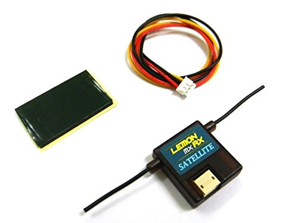

This libary allows you to access the signals on a Spektrum DSM
serial receiver using an Arduino or other microcontroller.  It uses interrupts,
rather than polling. The library provides two C++ classes: DSMRX1024, for
older receivers using seven channels and 10-bit precision; and DSMRX2048,
for modern receivers (like the Lemon RX) using eight channels and 11-bit
precision.  There is also a standalone
[sketch](https://github.com/simondlevy/DSMRX/tree/master/examples/BindSpektrum)
allowing you to bind your receiver to your transmitter using an Arduino Uno,
Mega, or other five-volt Arduino board.  

For maximum flexibility, the <b>DSMRX</b> class does not contain any Arduino-specific code.
Instead, as shown in this [example](https://github.com/simondlevy/DSMRX/blob/master/examples/ReadSpektrum/ReadSpektrum.ino#L27-L42), you write your own interrupt handler, which calls
the <b>DSMRX::handleSerialEvent()</b> method.  In turn, this method
calls the <b>dsmSerialAvailable()</b> and <b>dsmSerialRead()</b> methods that you've written to
supply the serial data.

I have tested this library only on the DSMRX2048 class.

This library borrows heavily from David McGriffy's [Drone Control
System](https://github.com/dmcgriffy/DroneControlSystem/blob/master/DCS/RX.cpp).

