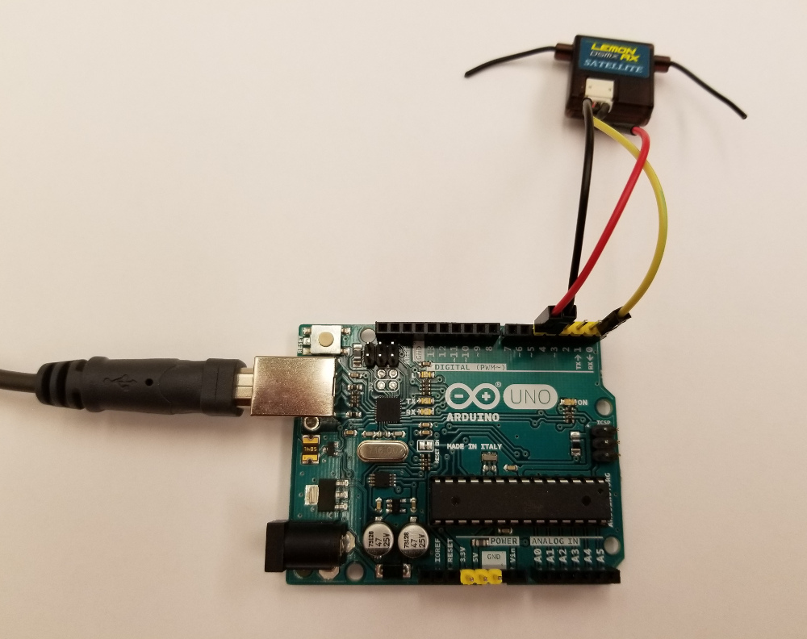

# Binding your Spektrum satellite receiver with an Arduino

This standalone Arduino sketch has been adapted from David McGriffy's
<a href="http://www.makedronesbook.com/sites/makedronesbook.com/files/spekbind.ino_.zip">spekbind</a>
sketch, to support both DMSX and DSM2 protocols.  

As David describes in Chapter 7 of his [Make Drones](https://www.amazon.com/Make-Drones-Teach-Arduino-Fly/dp/1680451715/ref=sr_1_1?ie=UTF8&qid=1477938491&sr=8-1&keywords=make%3A+drones) book, you will need a five-volt Arduino like the
Uno or Mega to use this sketch.

To select the protocol for your receiver simply comment/uncomment the appropriate <b>SPEK_BIND_PULSES</b>
constant definition at the 
[top of the program](https://github.com/simondlevy/SpektrumDSM/blob/master/examples/BindSpektrum/BindSpektrum.ino#L27-L31).
Then connect the receiver to the Arduino as shown (receiver power to digital pin 5; receiver ground to digital 4;
receiver signal to digital 0) and flash the sketch.  The receiver LED will blink rapidly, indicating that it is in
binding mode.  Power up your transmitter in binding mode (e.g., by holding the bind button down on a Spektrum DX8).
The transmitter should report the appropriate signal type (DSMX or DSM2), and the receiver LED should go solid red.
